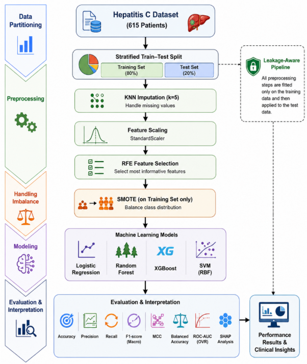
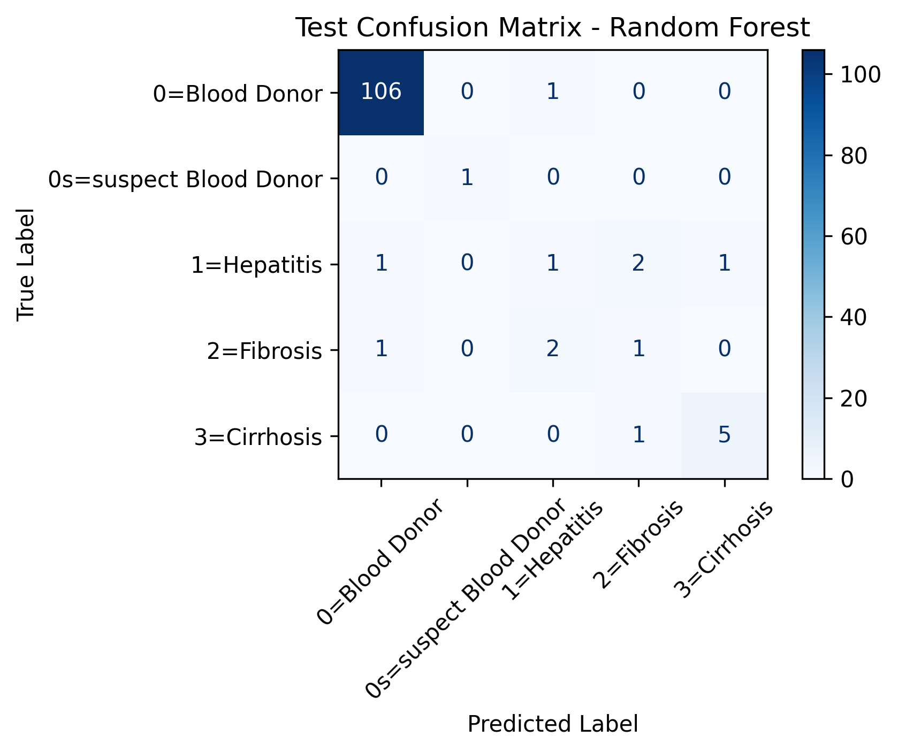
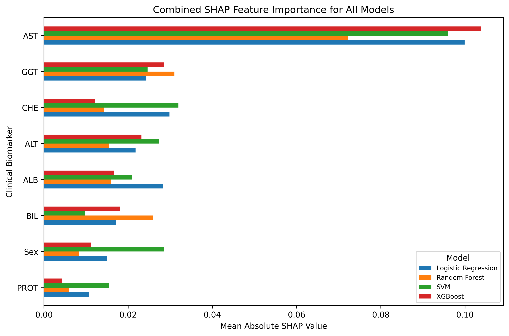

# Hepatitis C Classification Using a Leakage-Aware Machine Learning Pipeline and SHAP Analysis

This repository contains a machine learning project for multi-class Hepatitis C classification using demographic and clinical biomarker data. The project focuses on leakage-safe preprocessing, class imbalance handling, model comparison, and explainable artificial intelligence using SHAP analysis.

## Project Overview

Hepatitis C Virus (HCV) is a liver infection that may progress into serious conditions such as hepatitis, fibrosis, and cirrhosis. In this project, machine learning models were trained to classify patients into different HCV-related categories using clinical biomarkers.

The main purpose of this work is not only to achieve good prediction performance, but also to make sure that the machine learning pipeline avoids data leakage and provides interpretable results.

## Dataset

The project uses the publicly available Hepatitis C Prediction Dataset from Kaggle.

The target classes are:

- Blood Donor
- Suspect Blood Donor
- Hepatitis
- Fibrosis
- Cirrhosis

The main input features include:

- Age
- Sex
- ALB
- ALP
- ALT
- AST
- BIL
- CHE
- CHOL
- CREA
- GGT
- PROT

The dataset file is not included in this repository. Users should download the dataset from Kaggle and upload it when running the notebook.

## Methodology

A leakage-aware machine learning pipeline was used in this project. The dataset was first cleaned and then divided using a stratified 80:20 train-test split before applying further preprocessing. This ensures that the test set remains completely unseen during preprocessing and model training.

The preprocessing pipeline included KNN imputation with k = 5, feature scaling using StandardScaler, Recursive Feature Elimination using Logistic Regression, and SMOTE for class balancing. SMOTE was applied only on the training set. For extremely small minority classes, RandomOverSampler was used as a fallback.

The untouched test set was transformed only using the preprocessing parameters fitted on the training set. No oversampling was applied to the test set.

## Machine Learning Models

Four machine learning models were trained and compared:

- Logistic Regression
- Random Forest
- XGBoost
- Support Vector Machine

## Evaluation Metrics

The models were evaluated using both standard and imbalance-aware metrics:

- Accuracy
- Balanced Accuracy
- Macro Precision
- Macro Recall
- Macro F1-score
- Matthews Correlation Coefficient
- ROC-AUC One-vs-Rest

## Updated Test Results

| Model | Accuracy | Balanced Accuracy | Precision Macro | Recall Macro | F1 Macro | MCC | ROC-AUC OVR |
|---|---:|---:|---:|---:|---:|---:|---:|
| SVM | 0.8780 | 0.7846 | 0.7208 | 0.7846 | 0.7312 | 0.6140 | 0.9531 |
| Logistic Regression | 0.8537 | 0.8205 | 0.6630 | 0.8205 | 0.7091 | 0.5838 | 0.9315 |
| Random Forest | 0.9268 | 0.6548 | 0.6630 | 0.6548 | 0.6583 | 0.6842 | 0.9638 |
| XGBoost | 0.8862 | 0.6455 | 0.6278 | 0.6455 | 0.6343 | 0.5754 | 0.9658 |

Random Forest achieved the highest overall accuracy and MCC. XGBoost achieved the highest ROC-AUC. Logistic Regression achieved the highest balanced accuracy and macro recall. SVM achieved the highest macro F1-score, showing strong balanced performance across the imbalanced classes.

## Random Forest Per-Class Performance

| Class | Precision | Recall | F1-score | Support |
|---|---:|---:|---:|---:|
| Blood Donor | 0.9815 | 0.9907 | 0.9860 | 107 |
| Suspect Blood Donor | 1.0000 | 1.0000 | 1.0000 | 1 |
| Hepatitis | 0.2500 | 0.2000 | 0.2222 | 5 |
| Fibrosis | 0.2500 | 0.2500 | 0.2500 | 4 |
| Cirrhosis | 0.8333 | 0.8333 | 0.8333 | 6 |

The per-class results show that overall accuracy alone is not enough for this dataset. Minority disease classes such as Hepatitis and Fibrosis remain difficult to classify because of limited sample availability and overlapping biomarker patterns.

## Figures

### Machine Learning Pipeline



### Random Forest Confusion Matrix



### Combined SHAP Feature Importance



## Explainability

SHAP analysis was used to explain feature contributions across the trained models. The most influential features included AST, GGT, CHE, ALT, ALB, BIL, Sex, and PROT.

AST showed the highest overall SHAP importance across the evaluated models, indicating that it played a major role in the classification process.

## Repository Structure

```text
hepatitis-c-ml-leakage-aware-shap/
│
├── README.md
├── LICENSE
├── requirements.txt
├── Hepatitis_C_Prediction_Updated.ipynb
│
├── results/
│   ├── table_class_distribution.csv
│   ├── table_test_results.csv
│   ├── table_rf_per_class_results.csv
│   └── table_combined_shap_values.csv
│
├── figures/
│   ├── fig1_pipeline.png
│   ├── fig2_confusion_matrix_rf.png
│   └── fig3_combined_shap.png
│
└── paper/
    └── main_updated_results_final.tex
